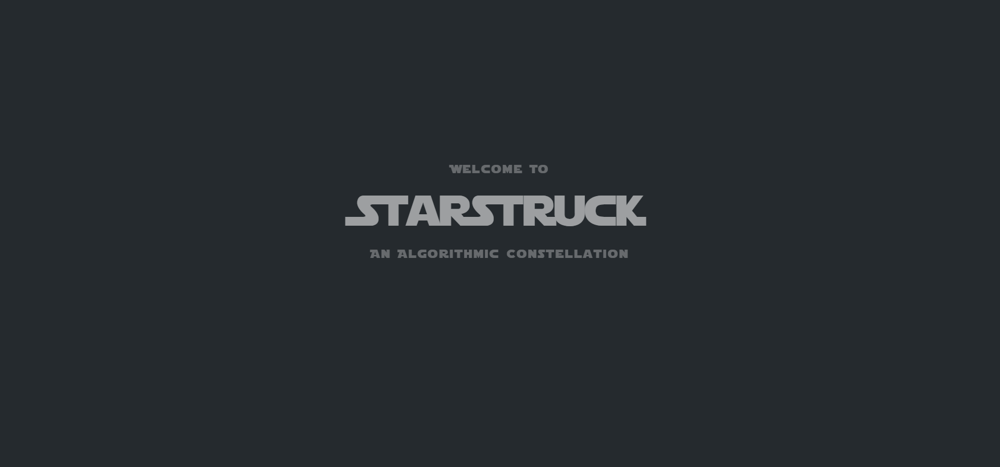
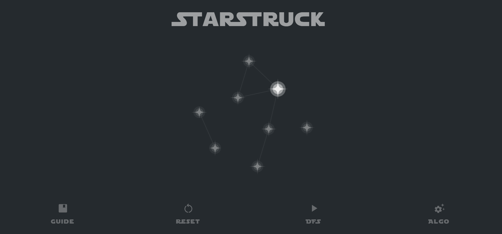
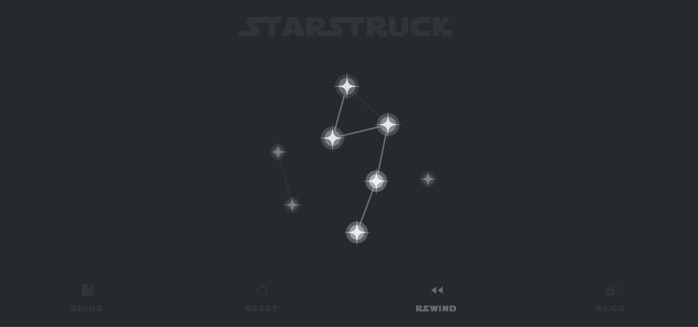
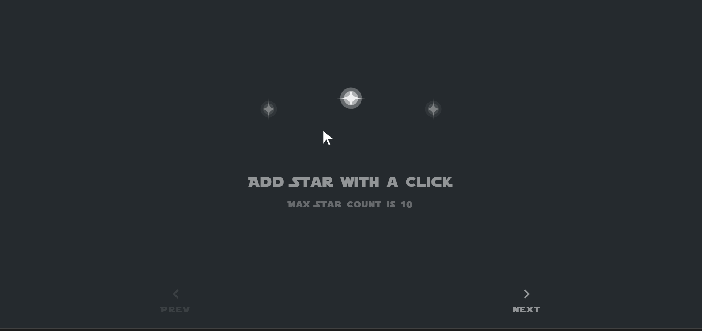
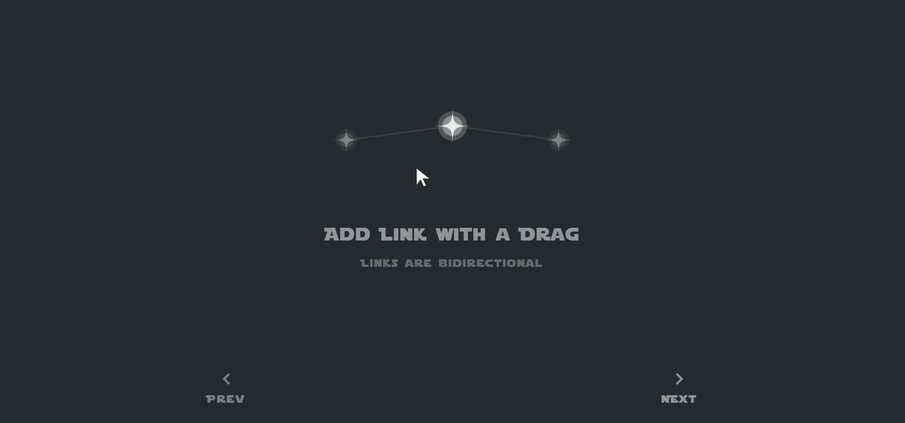
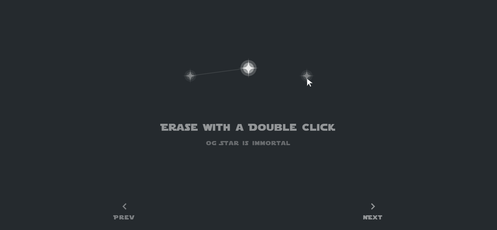
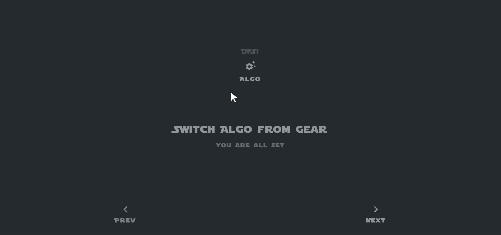

# StarStruck: An algorithmic constellation 

StarStruck is a creative take on graph-based algorithms that allows users to visualize breadth-first search and depth first search on a constellation they create.

It leverages d3 Force Directed Graphs for simulating physical forces on particles using velocity verlet integration. The guide screens at the beginning will assist you with the user actions.

Build you stellar creation and traverse through the stars!

Explore StarStruck: https://co18321.github.io/StarStruck/

## 1. Add Star with a Click
- Add stars to your constellation by simply clicking on the canvas.
- The maximum star count is 10

## 2. Add link with a Drag
- Connect stars in your constellation by dragging and creating links between them.
- Links are bidirectional.

## 3. Erase with a Double Click
- Remove unwanted stars from your constellation by double-clicking on them.
- The "OG Star" (star with persisted shine) is immortal and cannot be erased.

## 4. Switch Algorithm from Gear
- Dynamically switch between BFS and DFS algorithms for traversing the constellation.
- The "og Star" acts as the source for the selected algorithm.

